# macOS : Command Line Examples

I had to use [recovery mode](https://support.apple.com/en-us/HT204904) to install macOS on a 5 year old MacBook Air. This included an upgrade to Sonoma (14.2.1).

Then I used the terminal to build and test a series of familiar libraries and software tools from the unix command line

This repository is a snap-shot (aka "**note-to-future-self**") on the specifics of these examples. Likewise this code might be helpful for others experimenting with these libraries and tools.

---

| Example | Description | Result |
| --- | --- | --- |
| [mc_01_hello_world](examples/mc_01_hello_world) | An obligatory **ᚺƏᒹᒹ◉ ש◉ℜᒹ₫** using g++ (clang 15.0.0) and make (3.81). |  |
| [mc_02_opencv](examples/mc_02_opencv) | Distance transform of a [Fibonacci fractal](https://fractalfoundation.org/OFC/OFC-11-3.html) using **OpenCV** (4.8.0) and CMake (3.28.0). | 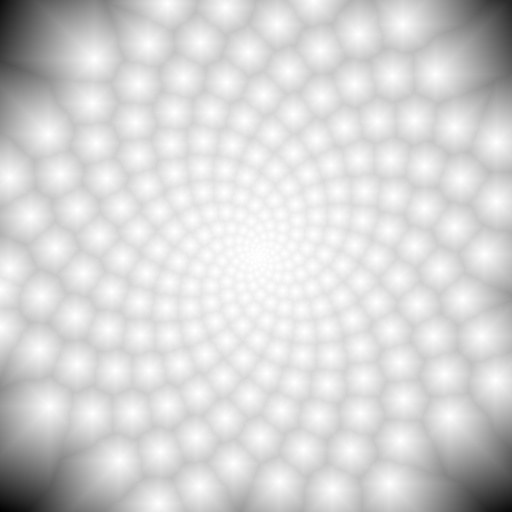 |
| [mc_03_eigen](examples/mc_03_eigen) | Apply 2D rotation to [Rose sinusoid](https://en.wikipedia.org/wiki/Rose_(mathematics)) XY data using **Eigen** (3.4.0). |  |
| [mc_04_libigl](examples/mc_04_libigl) | Blue noise sample a mesh surface using **libigl** (2.5.0). | 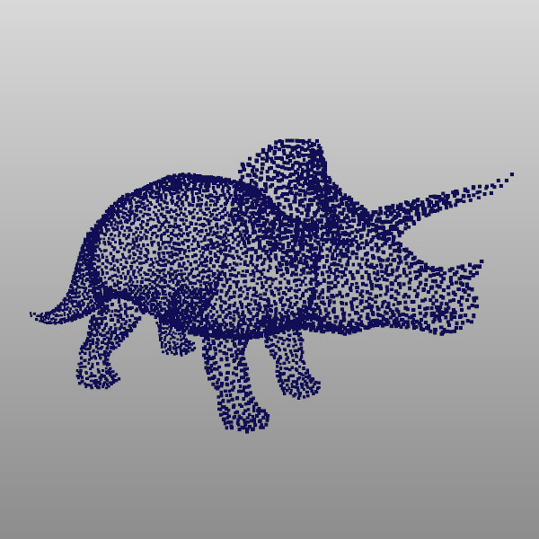 |
| [mc_05_libsvm](examples/mc_05_libsvm) | Train a [support vector machine](https://en.wikipedia.org/wiki/Support_vector_machine) as an orange color classifier using **libsvm** (3.32). | 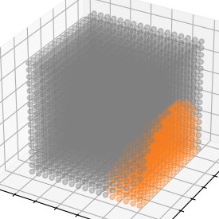 |
| [mc_06_bvh_v1](examples/mc_06_bvh_v1) | Implement a single view virtual 3D scanner using **BVH** (v1) and **happly** (v2). | 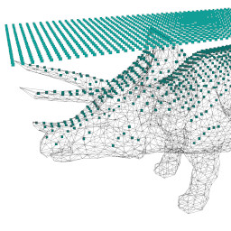 |
| [mc_07_pip3](examples/mc_07_pip3) | Generate simplex noise using the **opensimplex** (0.4.5) Python package installed with **Pip3** (21.2.4) and **opensimplex** (0.4.5). | 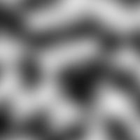|
| [mc_08_virtualenv](examples/mc_08_virtualenv) | Draw random lobster graphs with **virtualenv** (20.25.0) and **networkx** (3.2.1). |  |
| [mc_09_brew](examples/mc_09_brew) | Use **brew** (4.1.24) to install **wget** (1.21.4) and download an iceberg image. | 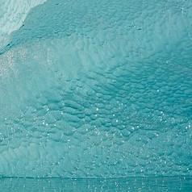 |
| [mc_10_boost](examples/mc_10_boost) | Create phase of moon toned calendar using **Boost** (1.83.0) and **MoonPhase**. | 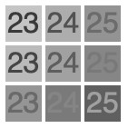 |
| [mc_11_armadillo](examples/mc_11_armadillo) | Fit a sphere to 3D points using **Armadillo** (12.6.6) and a variant of the **Thiel-Sen** estimator. | 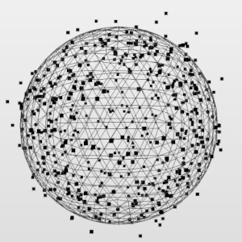 |
| [mc_12_ceres](examples/mc_12_ceres) | Fit a non-linear model to measured display luminances using the **Ceres Solver** (2.2.0_1). | 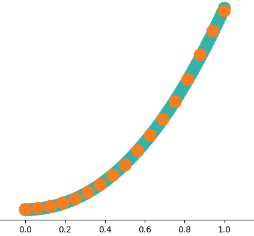 |
| [mc 13 ffmpeg](examples/mc_13_ffmpeg) | Create boomerang gifs using **FFmpeg** (6.0). | 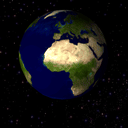 |
| [mc 14 mlpack](examples/mc_14_mlpack) | The **mlpack** (4.3.0) library is used to autoencode the spectra of a Munsell Book of Color.  |  |
| [mc 15 ensmallen](examples/mc_15_ensmallen) | Align two 2D contours using **ensmallen's** (2.21.0) particle swarm optimization. | 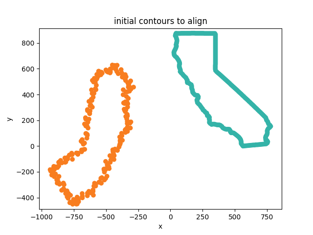  |
| [mc 16 cgal](examples/mc_16_cgal) | Compute 3D convex hull of mesh vertices using **CGAL** (5.6). | 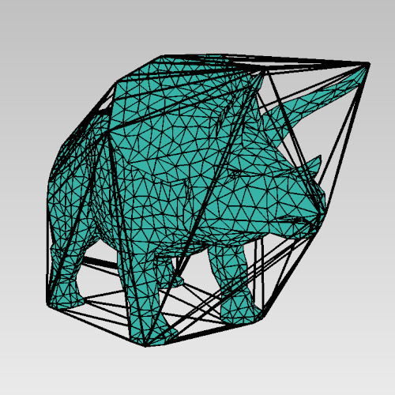 |
| [mc 17 ranger](examples/mc_17_ranger) | Train another orange classifer using **Ranger**'s (0.16.0) random forests. | 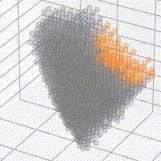 |
| [mc 18 tesseract](examples/mc_18_tesseract) | Apply optical character recognition to an input image using **Tesseract** (5.3.3). | 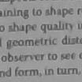 |
| [mc 19 pytorch midas](examples/mc_19_pytorch_midas) | Derive depth estimates for an input image using the pre-trained **MiDaS** (DPT large)  **PyTorch** (1.11.0) model. | 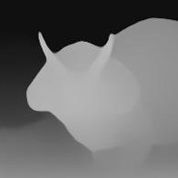 |
| [mc 20 matplotlib](examples/mc_20_matplotlib) | Contour plot simplex noise using **matplotlib** (3.8.2) and automatically create a PNG from input TSV. | 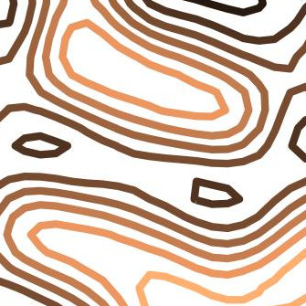 |

