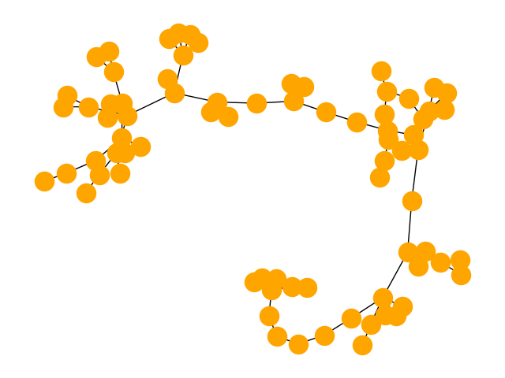

# macOS : Command Line Examples

I had to use [recovery mode](https://support.apple.com/en-us/HT204904) to install macOS on a 5 year old MacBook Air. This included an upgrade to Sonoma (14.2.1).

Then I used the terminal to build and test a series of familiar libraries and software tools from the unix command line

This repository is a snap-shot (aka "**note-to-future-self**") on the specifics of these examples. Likewise this code might be helpful for others experimenting with these libraries and tools.

---

| Example | Description | Result |
| --- | --- | --- |
| [mc_01_hello_world](examples/mc_01_hello_world) | **Hello world** using g++ (clang 15.0.0) and make (3.81) |  |
| [mc_02_opencv](examples/mc_02_opencv) | Distance transform using **OpenCV** (4.8.0) and CMake (3.28.0) |  |
| [mc_03_eigen](examples/mc_03_eigen) | Apply 2D rotation to XY data using **Eigen** (3.4.0) |  |
| [mc_04_libigl](examples/mc_04_libigl) | Blue noise sample a mesh surface using **libigl** (2.5.0) |  |
| [mc_05_libsvm](examples/mc_05_libsvm) | Train an orange color classifier using **libsvm** (3.32) |  |
| [mc_06_bvh_v1](examples/mc_06_bvh_v1) | Implement a single view virtual 3D scanner using **BVH** (v1) and **happly** (v2) |  |
| [mc_07_pip3](examples/mc_07_pip3) | Generate simplex noise Python package with **Pip3** (21.2.4) and **opensimplex** (0.4.5) | |
| [mc_08_virtualenv](examples/mc_08_virtualenv) | Draw random lobster graphs with **virtualenv** (20.25.0) and **networkx** (3.2.1) |  |
| [mc_09_brew](examples/mc_09_brew) | Use **brew** (4.1.24) to install **wget** (1.21.4) and download an iceberg image. |  |
| [mc_10_boost](examples/mc_10_boost) | Create phase of moon toned calendar using **Boost** (1.83.0) and **MoonPhase**|  |

