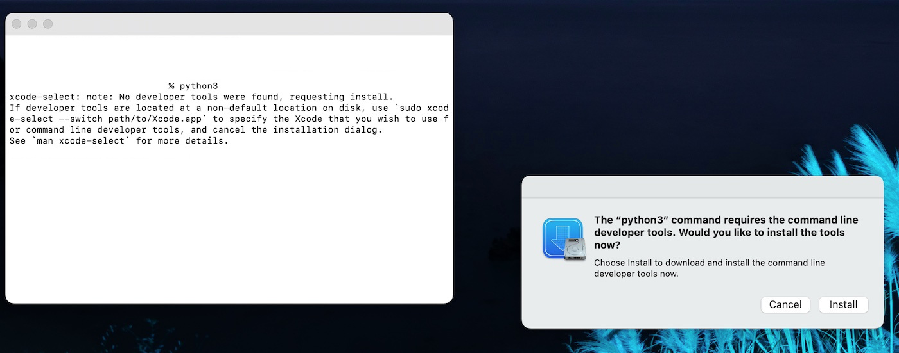

## macOS : Command Line Examples - *(ᚺƏᒹᒹ◉  ש◉ℜᒹ₫)*

The first example uses g++ to compile a C++ hello world program.

Begin by opening a terminal window using command+space and enter ```terminal```.

Then type in ```python3``` to initiate an installation pop-up. 

Should also work with ```g++``` but I got the screenshot below with ```python3```.



Accept and install these tools, including g++ and make. The g++ version is clang 15.0.0 and the make version is 3.81.

The C++ source is [here](hello_world.cc) and the Makefile is [here](Makefile). 

I used the ```vi``` editor with [syntax highlighting on](https://apple.stackexchange.com/questions/320287/how-do-i-enable-syntax-highlighting-in-vim-on-mac). The result of running the program is below.


Easy peasy.

