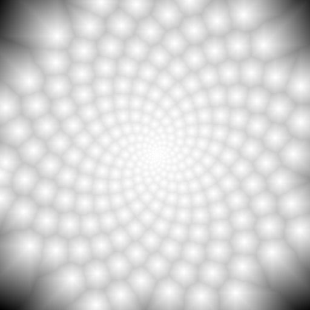

## macOS : Command Line Examples - *OpenCV (Sunflower Fractal)* 

The second example is building and using [OpenCV](https://github.com/opencv/opencv). 

In this case, the library was [built from source](https://docs.opencv.org/3.4/d0/db2/tutorial_macos_install.html) by first downloading it :

```
git clone https://github.com/opencv/opencv.git
```
And a build directory was created and entered :

```
mkdir build
cd build
```

CMake was used to build, which can be installed [from here](https://cmake.org/download/). The specific version :

```
cmake --version
cmake version 3.28.0-rc5
```

Then run the following to compile everything. This will take a while.

```
cmake -DCMAKE_BUILD_TYPE=Release -DBUILD_EXAMPLES=OFF ../opencv
sudo make install
```

End result is OpenCV 4.8.0-dev is ready to go.

---

To test the installation, this [source](ocv_distance_transform.cc) was compiled with this [Makefile](Makefile).

This program generated a 2D sampling of pixels according to the [golden angle](https://en.wikipedia.org/wiki/Golden_angle) or [Fibonacci fractals](https://fractalfoundation.org/OFC/OFC-11-3.html).

From this sparse sampling of points, the [distance transform](https://en.wikipedia.org/wiki/Distance_transform) was calculated.

The normalized and inverted result is below :



Groovy.

