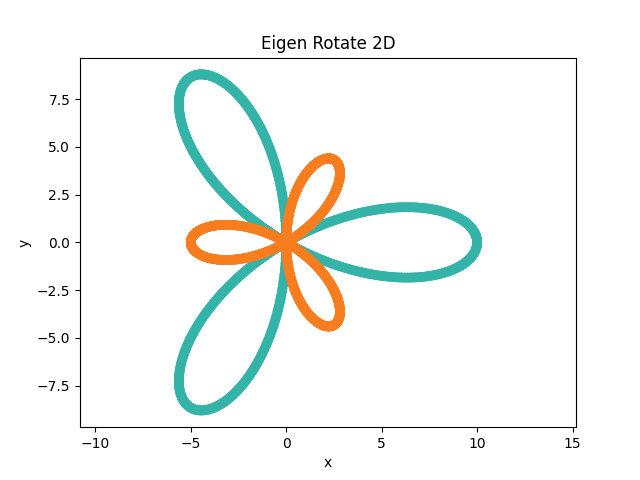

## macOS : Command Line Examples - *Eigen (2D Rotation)*

[Eigen](https://eigen.tuxfamily.org/index.php?title=Main_Page) is a header only templated library for linear algebra.

It can be downloaded as a .zip from [this web page](https://eigen.tuxfamily.org/index.php?title=Main_Page) on the upper right of the page. As a header only library, to use simply link against the source headers.

As an example of using Eigen, a [2D rotation](https://eigen.tuxfamily.org/dox/classEigen_1_1Rotation2D.html) is applied to input XY data. A [rose (mathematical) sinusoid](https://en.wikipedia.org/wiki/Rose_(mathematics)) is sampled and used as the test data.

This [source](eigen_rotate_2d.cc) was compiled with this [Makefile](Makefile) (update the path the Eigen installation location).

```
./eigen_rotate_2d
eigen rotate 2d :
eigen version :
  world : 3
  major : 4
  minor : 0

radians : 1.0472
      0.5 -0.866025
 0.866025       0.5
```
The result plotted as a color scatter diagram with matplolib is shown below.

The input data is shown as teal colored and the Eigen 2D rotated (and scaled) data is shown in orange.




