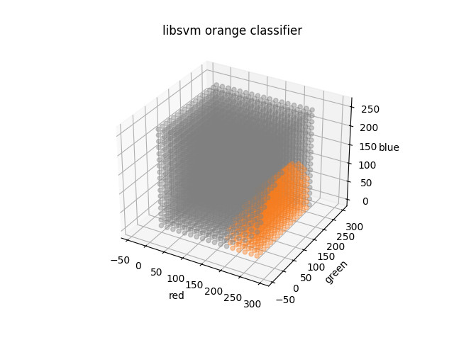
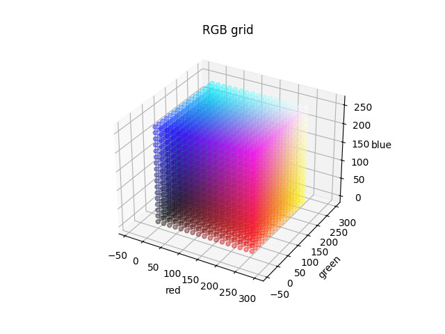

## macOS : Command Line Examples - *libsvm (orange classifier)*

[Support vector machines](https://en.wikipedia.org/wiki/Support_vector_machine) or SVMs have been used for classification and regression.

[libsvm](https://www.csie.ntu.edu.tw/~cjlin/libsvm/) is a library for support vector machines, although for this example only the compiled executables are used.

After downloading the source, it is only necessary to type ```make``` to compile the programs ```svm-train``` and ```svm-predict```.

This example trains and evaluates an orange color classifier.

The included C++ program formats data as required by libsvm while the Makefile trains, validates and processes a grid of RGB samples.

For the validation step, this is the program output :

```
svm-predict validate_orange_svm.txt train_orange_svm.txt.model validate_predicted.txt
Accuracy = 93.7% (937/1000) (classification)
```
```matplotlib``` was used to plot a grid sampling of RGB's. 

The result below shows oranges in orange and all other colors as gray :



For visual comparison, the same grid sampling is shown with the original RGB's :



!teal
