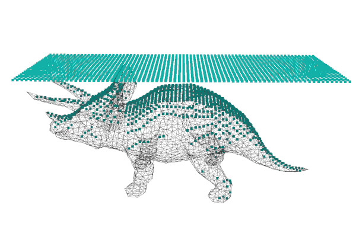

## macOS : Command Line Examples - *BVH-V1 (virtual 3D scan)*

A [bounding volume hierarchy](https://en.wikipedia.org/wiki/Bounding_volume_hierarchy) is a tree structure that cen be used to perform  efficient triangle-ray intersection calculations.

This [BVH Repository](https://github.com/madmann91/bvh) is an awesome implementation and for this example [version 1](https://github.com/madmann91/bvh/tree/v1) is used.

This example also uses the [happly](https://github.com/nmwsharp/happly) header to read in an input [PLY](https://en.wikipedia.org/wiki/PLY_(file_format)) mesh.

This [C++](bvh-virtual_3d_scanner.cc) is a single view virtual 3D scanner for a given input 3D object.

The result below shows a planar grid sampling (the top plane of teal points) and the resulting intersections.

The direction of projection is -Z (or downwards wrt the page) and points on the triceroptos are the triangle-ray intersections.



---

Note that this example does not make use of happly's automatic [type promotion](https://en.wikipedia.org/wiki/Type_conversion#Type_promotion) (floats to doubles).

Instead the following was used to read in the vertices as floats:

```cpp
    std::vector<float> xPos = plyIn.getElement("vertex").getProperty<float>("x");
    std::vector<float> yPos = plyIn.getElement("vertex").getProperty<float>("y");
    std::vector<float> zPos = plyIn.getElement("vertex").getProperty<float>("z");
    
    Vertices vs(xPos.size());
    for (size_t i = 0; i < vs.size(); i++) {
      vs[i][0] = xPos[i];
      vs[i][1] = yPos[i];
      vs[i][2] = zPos[i];
    }
```
