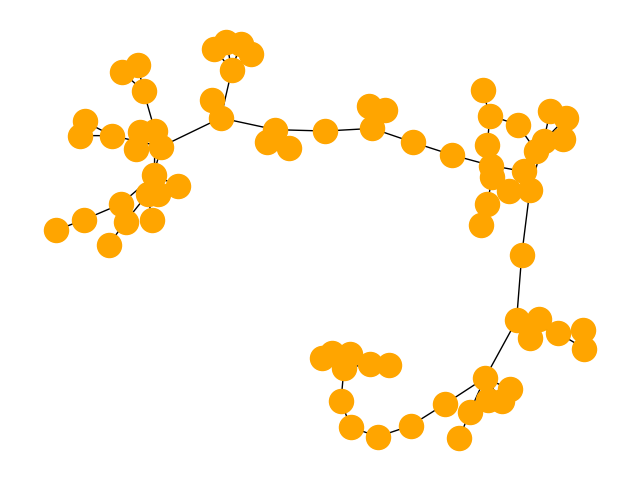

## macOS : Command Line Examples - *virtualenv (random lobster)*

Use ```pip3``` to install ```virtualenv``` to create and use [Python virtual environments](https://docs.python.org/3/library/venv.html).

```
pip3 install virtualenv
```

The specific version can be chcked (update the username) :

```
% /Users/username/Library/Python/3.9/bin/virtualenv --version
virtualenv 20.25.0
```

Once installed create a virtual environment to install the [networkx](https://networkx.org/documentation/latest/index.html) package for network analysis.

```
/Users/username/Library/Python/3.9/bin/virtualenv venv_netx
```

Which can be activated :

```
source venv_netx/bin/activate
```

Note once activated, the following text :  ```(venv_netx)``` will be added to the beginning of your terminal prompt.

Then the networkx package (and matplotlib & scipy packages) can be installed in venv_netx

```
pip3 install networkx
pip3 install matplotlib
pip3 install scipy
```

The example (python below) then generates and draws a random [lobster graph](https://mathworld.wolfram.com/LobsterGraph.html).

```
import networkx as nx
import matplotlib.pyplot as plt
G = nx.random_lobster(75, 0.5, 0.5)   # 100
nx.draw(G, node_color="orange")
plt.savefig("random_lobster.png")
print(G)
```

The figure below shows the random lobster for n=75, p1=0.5 and p2=0.5.



When done, deactivate the networkx virtual environment :

```
% deactivate
```

---

*random rock lobster?*
