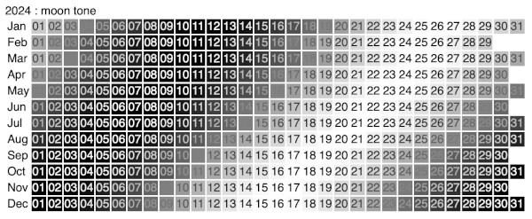

## macOS : Command Line Examples - *Boost (moon tone)*

Brew was used to [install](https://formulae.brew.sh/formula/boost) Boost (version 1.83.0) via ```brew install boost```.

The [Date_Time](https://www.boost.org/doc/libs/1_83_0/doc/html/date_time.html) library is useful for temporal calculations. I first tested it by using it to compute the number of days between two haircuts.

This example generates a year calendar that has lightness or tones based on the phase of the moon.

I find that using [alias declarations](https://www.reddit.com/r/cpp/comments/d7wqg5/how_c_using_or_aliasdeclaration_is_better_than/) are helpful when integrating Boost code. The following are used in the [source](moon_tone.cc) file : 

```cpp
  using PosixTime = boost::posix_time::ptime;
  using Date      = boost::gregorian::date;
  using Calendar  = boost::gregorian::gregorian_calendar;
  using DayItr    = boost::gregorian::day_iterator;
```

First, the [seconds since eopch](https://www.boost.org/doc/libs/1_42_0/doc/html/date_time/examples.html#date_time.examples.seconds_since_epoch) are computed. Then the [MoonPhase](https://github.com/signetica/MoonPhase) class is used to compute a tone per day based on the phase of the moon.

The results formatted as an HTML table for 2024 are below :




