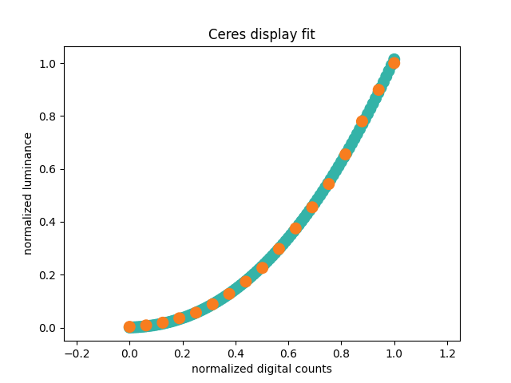

## macOS : Command Line Examples - *Ceres (non-linear display fit)*

This is example uses the [Ceres Solver](http://ceres-solver.org) to fit a non-linear model to display measurements.

Luminance measureents were made of a gray ramp for a display and the following model was fit :

```
y = ((gain * x) + offset)^gamma
```

This gain-offset-gamma model was developed for [CRTs](https://en.wikipedia.org/wiki/Cathode-ray_tube) but is also part of stanadrads, such as [sRGB](https://en.wikipedia.org/wiki/SRGB).

A key piece of the program is the definition of the model residual :

```cpp
  class gain_offset_gamma_residual {
    public:
      gain_offset_gamma_residual(double digital_count, double luminance)
          : digital_count_(digital_count), luminance_(luminance) {}

      template <typename T>
      bool operator()(const T *const gain,
                      const T *const offset,
                      const T *const gamma,
                      T *residual) const
      {

        residual[0] = luminance_ - pow(((digital_count_ * gain[0]) + offset[0]), gamma[0]);

        return true;
      }

    private:
      const double digital_count_, luminance_;
  };
```

The output below shows the iterations during fitting and the final estimates for the parameters.

```
./ceres-display_fit
iter      cost      cost_change  |gradient|   |step|    tr_ratio  tr_radius  ls_iter  iter_time  total_time
   0  5.873065e-01    0.00e+00    4.36e+00   0.00e+00   0.00e+00  1.00e+04        0    3.00e-04    7.05e-03
   1  9.208769e-02    4.95e-01    1.05e+00   0.00e+00   8.48e-01  1.51e+04        1    3.60e-04    7.49e-03
   2  1.845169e-01   -9.24e-02    1.05e+00   1.24e+00  -1.01e+00  7.54e+03        1    3.50e-05    7.58e-03
   3  1.798884e-01   -8.78e-02    1.05e+00   1.23e+00  -9.57e-01  1.88e+03        1    8.11e-06    7.60e-03
   4  1.575214e-01   -6.54e-02    1.05e+00   1.18e+00  -7.13e-01  2.35e+02        1    7.87e-06    7.61e-03
   5  8.855572e-02    3.53e-03    3.03e+00   9.99e-01   3.86e-02  1.32e+02        1    2.54e-04    7.88e-03
   6  1.724187e-03    8.68e-02    2.47e-01   1.24e-01   9.91e-01  3.96e+02        1    2.27e-04    8.12e-03
   7  6.918882e-04    1.03e-03    3.14e-02   1.84e-01   9.92e-01  1.19e+03        1    2.25e-04    8.36e-03
   8  4.119988e-04    2.80e-04    3.33e-02   2.58e-01   9.42e-01  3.56e+03        1    2.23e-04    8.60e-03
   9  3.175289e-04    9.45e-05    1.11e-02   1.40e-01   9.87e-01  1.07e+04        1    2.12e-04    8.85e-03
  10  3.116888e-04    5.84e-06    4.97e-04   2.59e-02   1.02e+00  3.20e+04        1    2.25e-04    9.09e-03
  11  3.116549e-04    3.40e-08    1.19e-05   2.75e-03   1.03e+00  9.61e+04        1    2.09e-04    9.32e-03
Ceres Solver Report: Iterations: 12, Initial cost: 5.873065e-01, Final cost: 3.116549e-04, Termination: CONVERGENCE

display fit :
  gain   : 0.974866
  offset : 0.0313862
  gamma  : 2.23638
```

The plotted results are below, with the measurements in orange and the fitted function in teal.



---

yeeha


