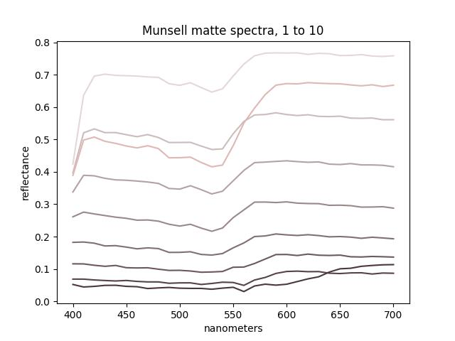
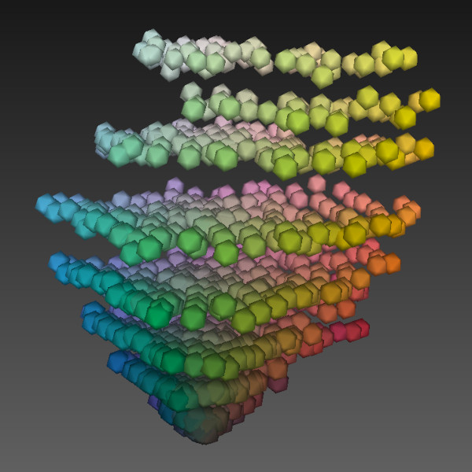

## macOS : Command Line Examples - *mlpack (spectral autoencoder)*

[mlpack](https://www.mlpack.org) is header only machine learning library. This library can be used to implement [autoencoders](https://en.wikipedia.org/wiki/Autoencoder).

Autoencoders are neural networks that are trained to reconstruct input data given a bottleneck in the network.

The size of the bottleneck effectively defines a reduced dimensionality for the data.

For this example, we start with [this spectral data](https://sites.uef.fi/spectral/databases-software/munsell-colors-matt-spectrofotometer-measured/) for measurements taken of a matte [Munsell](https://en.wikipedia.org/wiki/Munsell_color_system) Book of Color.

This data was sub-sampled to the range 400-700 nm in steps of 10 nm. The first ten spetcra are plotted below :



This input data is then 31 dimensions and this [code](mlpack-spectral_autoencoder.cc) adds a 3 dimensional bottleneck. 

For version 4.3.0 of mlpack pack this is how the autoencoder is defined :

```
    ffn.Add<Identity>();
    ffn.Add<Linear>(hidden_layer_size);   // encoder                         
    ffn.Add<Identity>();
    ffn.Add<Linear>(output_size);         // decoder
    ffn.Add<Identity>();
```

The hidden layer size is 3 and the input and output sizes are 31.

The resulting view of the 3 dimensional encoding of the Munsell spectra is shown below :



Nifty.

