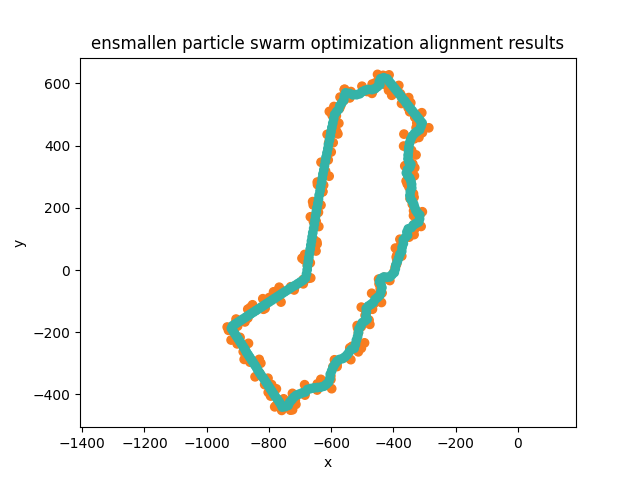

## macOS : Command Line Examples - *ensmallen (2D contour alignment)*

[Ensmallen](https://ensmallen.org) (version 2.21.0) is non-linear optimization library.

This example uses particle swarm optimization to align two 2D contours.

The [nanoflann library](https://github.com/jlblancoc/nanoflann) is used for nearest neighbor queries. This code uses this [adaptor](https://github.com/jlblancoc/nanoflann/blob/master/examples/KDTreeVectorOfVectorsAdaptor.h) for ```std::vector<std::vector<T> >```.

For instance, consider two initial contours shown below. A noisy refrence point set (orange) and a contour to be aligned to the reference (teal).


The result of running the optimization :

```
contour alignment one :
ca size : 245
random degrees : 123.046
f count : 5984
Minimum of summed nearest distance function found with particle swarm optimization is 123.057684
```

Which when plotted looks like :



Note that the contours are aligned on the origin (0,0) before the optimization.

