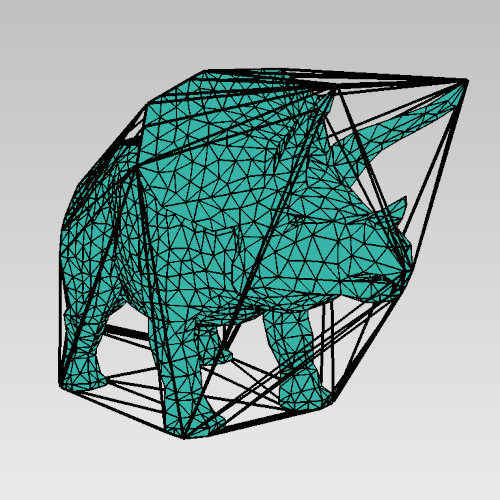

## macOS : Command Line Examples - *CGAL (3D Convex Hull)*

Read in the triceroptos mesh, then comput the 3D convex hull for just the vertices of the mesh.

The results below show the convex hull as thicker black lines which entirely contain the teal mesh.

