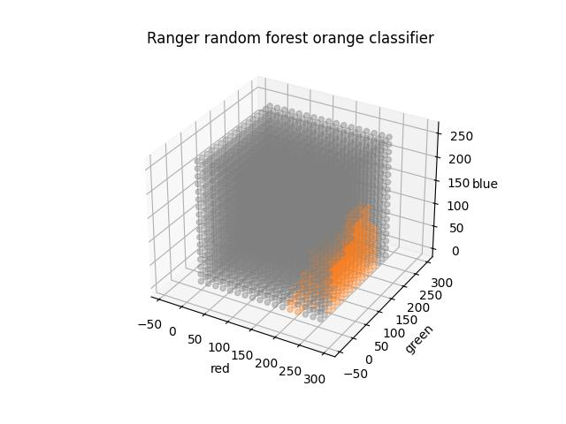
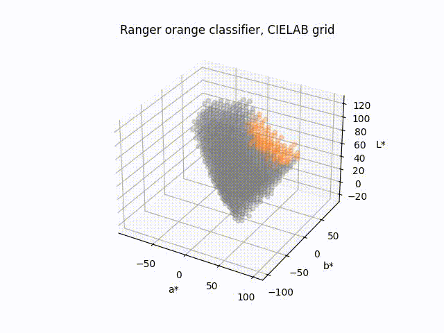

## macOS : Command Line Examples - *Ranger (orange classifier)*

[Random forests](https://en.wikipedia.org/wiki/Random_forest) are an ensemble learning method that can be used to train classifiers.

[Ranger](https://github.com/imbs-hl/ranger) (version 0.16.0) is a fast C++ implementation of random forests.

This example re-uses the data from the [libsvm example](../mc_05_libsvm) to train another classifier.

A visualization of the resulting Ranger orange classifier tested with an RGB grid is below :



---

As a second visualization, a grid of [CIELB](https://en.wikipedia.org/wiki/CIELAB_color_space) data within the sRGB gamut can be processed with the classifier.

The [ffmpeg example](../mc_13_ffmpeg/) can be used to visualize the results as a simple two frame overlay.



The specific ffmpeg parameters used (including in this case a crop) are below :

```
ffmpeg -framerate 1 -pattern_type glob -i 'cie*.jpg' -filter:v "crop=200:200:241:134" ranger-random_forest-orange_classifier-02.gif
```

