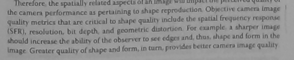
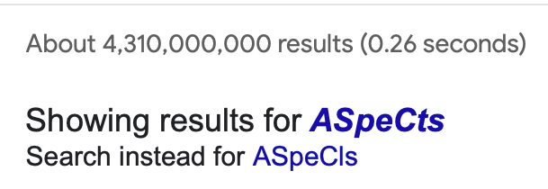

## macOS : Command Line Examples - *Tesseract (optical character recognition)*

[Tesseract](https://en.wikipedia.org/wiki/Tesseract_(software)) is an optical charecter recognition (OCR) engine.

As the 18th example, **tessearct** version 5.3.3 has already been installed - otherwise [brew can be used](https://formulae.brew.sh/formula/tesseract).

Using a webcam image of a paragraph from page 9 of [Camera Image Quality Benchmarking](https://www.wiley.com/en-us/Camera+Image+Quality+Benchmarking-p-9781119054498) by Philips & Eliasson (2018) as the input image :



yields the text below as the result :

```
therefore, the spatially cesise ASpeCls Cie eee ee
the camera performance as pertaining to shape reproduction. Objective camera image
quality metrics that are critical to shape quality include the spatial frequency respanse
(SER), resolution, bit depth, and geometric distortion. For example, a sharper image
should increase the ability of the observer to see edges and, thus, shape and form in the
Image Greater quality of shape and form, in ux, provides better camera image quality
```
---



