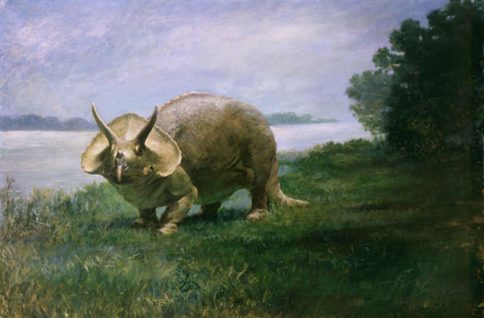

## macOS : Command Line Examples -  *PyTorch (MiDaS depth estimation)*

Use the pre-trained [MiDaS depth estimation](https://github.com/isl-org/MiDaS) [PyTorch model](https://pytorch.org/hub/intelisl_midas_v2/) to estimate a depth map from a single input image.

Assume [pip3](../mc_07_pip3) and [venv](../mc_08_virtualenv) already installed. Start with creating and activating a virtual environment :

```
mkdir env_midas
python3 -m venv env_midas
source env_midas/bin/activate
```

Install torch (1.11.0), timm and opencv for python :

```
pip3 install torch==1.11.0 torchvision==0.12.0 -f https://download.pytorch.org/whl/cpu
pip3 install timm
pip3 install opencv-python
```

The following python will download the MisDaS (DPT large) pre-trained model :

```
import torch

model_type = "DPT_Large"
midas = torch.hub.load("intel-isl/MiDaS", model_type)
```

Using this example image ([attribution](https://en.wikipedia.org/wiki/File:Knight_Triceratops.jpg)) as the input :



The depth estimatoin can be run using the included python :

```
python3 midas_depth_estimation.py Knight_Triceratops.jpg
```

And the resulting estimated depth map is shown below :


And when done with example, deactivate the virtual environment :

```
deactivate
```
