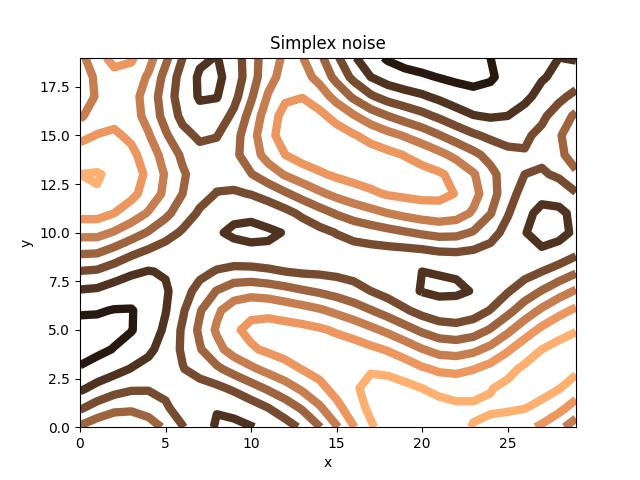

## macOS : Command Line Examples - *Matplotlib (simplex noise contours)* 

[Matplotlib](https://matplotlib.org) is a Python library for visualization.

It can be installed with ```pip3 install matplotlib```.

This example uses [a script](tsv_to_contour.py) to automate the generation of PNG's directly from formatted TSV files.

In this case the [earlier example](../mc_07_pip3/) generating simplex noise is visualized as a contour surface.



In this case, the [copper colormap](https://matplotlib.org/stable/users/explain/colors/colormaps.html) was used with linewidth of 6. 

---

[walk()](/python_visualizations/)
