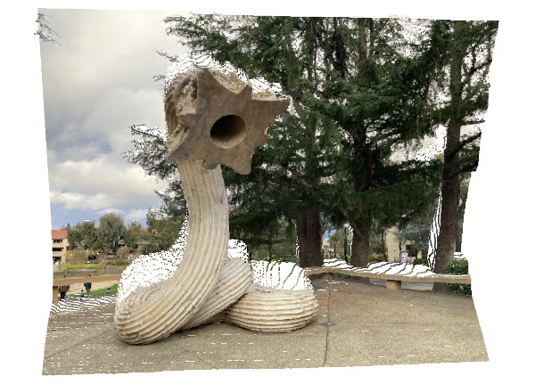

## macOS : Command Line Examples - *PCL Viewer (Depth GIFs)*

This example builds directly on the previous [Point Cloud Library (PCL) example ](../mc_22_pcl/).

By installing PCL, the [Visualization Toolkit (VTK)](https://vtk.org) is also installed.

Unlike previous examples, having VTK installed allows the creation of interactive examples or a basic UI.

The following example creates a color point cloud viewer for MiDaS depth estimated images.

The image below (["Hello" by XU ZHEN®](https://news.stanford.edu/2022/02/04/new-sculpture-lip-meyer-green-greets-passersby/), photo by n8) is used as the input :

 

The PyTorch [MiDaS edpth estimation example](../mc_19_pytorch_midas/) yields the depth estimates below :


[OpenCV](../mc_02_opencv/) is used to read the color and depth images above.

Then an XYZRGB point cloud is created and a corresponding viewer yields the following :



Cool! But can we get a GIF to demo the depth effect?

The [QuickTime player](https://support.apple.com/en-us/102618) can be used to record a mov of the window with the viewer in action.

Finally, [ffmpeg](../mc_13_ffmpeg/) can be used to trim, re-size and format the result to a GIF.


Voila, a depth gif.

---

As a footnote, what a color conversion for the OpenCV RGB pixel to PCL RGBA point color!

```cpp
        cv::Vec3b pixel = bgr.at<cv::Vec3b>(r, c);
        std::uint32_t color = ((std::uint32_t)(pixel[2]) << 16 |
                               (std::uint32_t)(pixel[1]) <<  8 |
                               (std::uint32_t)(pixel[0]));
        cp->points[k].rgb = *reinterpret_cast<float*>(&color);
```

