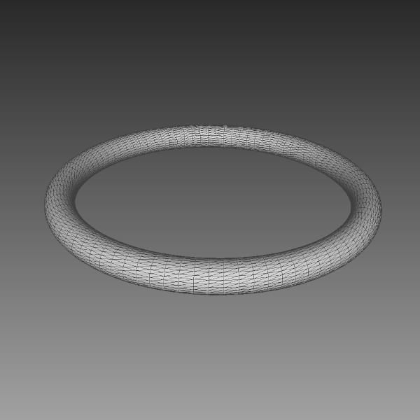

## macOS : Command Line Examples - *VCGLib (Generate Torus)*

The Visualization and Computer Graphics Library or [VCGLib](https://github.com/cnr-isti-vclab/vcglib) (version 2023.12) is a library for processing triangular meshes.

It is used in the [MeshLab](https://www.meshlab.net) application and is a templated, no dependency library.

For this library, download the source and link against (there is no homebrew installation).

This example generates a torus and uses [happly](https://github.com/nmwsharp/happly) to wtite out the result as a PLY file.



---

When integrating VCGLib the following initial declarations can be useful :

```cpp
  struct MeshTypes : public vcg::UsedTypes< vcg::Use<MeshVertex>::AsVertexType,
                                            vcg::Use<MeshFace>::AsFaceType > { };
  class MeshVertex : public vcg::Vertex< MeshTypes,
                                         vcg::vertex::VFAdj,
                                         vcg::vertex::Coord3f,
                                         vcg::vertex::Normal3f,
                                         vcg::vertex::BitFlags > { };
  class MeshFace : public vcg::Face< MeshTypes,
                                     vcg::face::VFAdj,
                                     vcg::face::FFAdj,      // convex hull
                                     vcg::face::Normal3f,
                                     vcg::face::VertexRef,
                                     vcg::face::BitFlags > { };
  class VCGTriangles : public vcg::tri::TriMesh< std::vector<MeshVertex>,
                                                 std::vector<MeshFace> > { };
```
