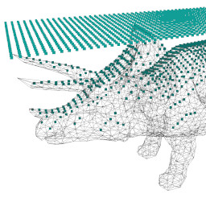
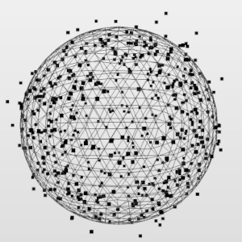
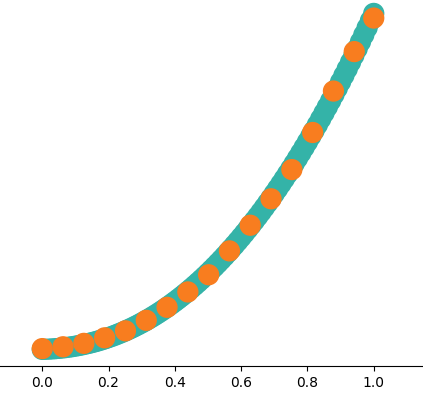
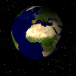

## macOS : Command Line Examples 

These examples were completed in the numeric order used in the directory name.

This is not required but this order factors into the overall installation sequence.

The examples are mostly C++, with some Python.

Generally use the simplest already installed tool (*vi, make, python3, pip3, git*).

| Examples | | | | |
| --- | --- | --- | --- | --- |
|  [mc_01_hello_world](mc_01_hello_world) |  [mc_02_opencv](mc_02_opencv) |  [mc_03_eigen](mc_03_eigen) |  [mc_04_libigl](mc_04_libigl)  |  [mc_05_libsvm](mc_05_libsvm) |
|  [mc_06_bvh_v1](mc_06_bvh_v1) |  [mc_07_pip3](mc_07_pip3) |  [mc_08_virtualenv](mc_08_virtualenv) |  [mc_09_brew](mc_09_brew) |  [mc_10_boost](mc_10_boost) |
|  [mc_11_armadillo](mc_11_armadillo) |  [mc_12_ceres](mc_12_ceres) |  [mc_13_ffmpeg](mc_13_ffmpeg) |  [mc_14_mlpack](mc_14_mlpack) |  [mc_15_ensmallen](mc_15_ensmallen) |
|  [mc_16_cgal](mc_16_cgal) |  [mc_17_ranger](mc_17_ranger) |  [mc_18_tesseract](mc_18_tesseract) |  [mc_19_pytorch midas](mc_19_pytorch_midas) |  [mc_20_matplotlib](mc_20_matplotlib) |
|  [mc 21 stable diffusion](mc_21_stable_diffusion_cpp) | | |

